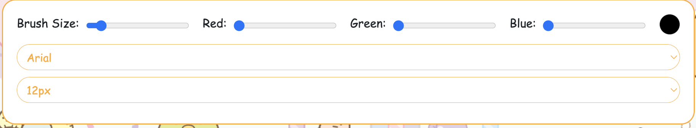
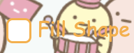
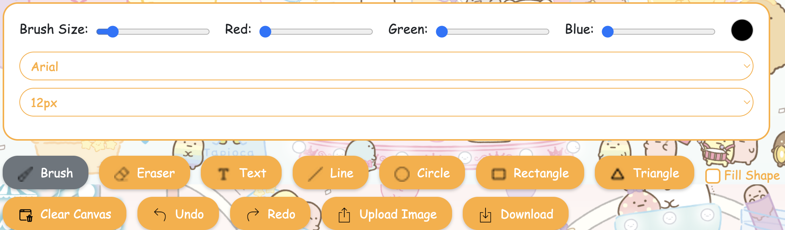

# Web Canvas
This is "2024 Spring CS241002 Software Studio" course project at National Tsing Hua University (NTHU).

### Scoring

| **Basic components**                             | **Score** | **Check** |
| :----------------------------------------------- | :-------: | :-------: |
| Basic control tools                              | 30%       | Y         |
| Text input                                       | 10%       | Y         |
| Cursor icon                                      | 10%       | Y         |
| Refresh button                                   | 5%        | Y         |

| **Advanced tools**                               | **Score** | **Check** |
| :----------------------------------------------- | :-------: | :-------: |
| Different brush shapes                           | 15%       | Y         |
| Undo/Redo button                                 | 10%       | Y         |
| Image tool                                       | 5%        | Y         |
| Download                                         | 5%        | Y         |

| **Other useful widgets**                         | **Score** | **Check** |
| :----------------------------------------------- | :-------: | :-------: |
| Checkbox to toggle shape fill                    | 1~5%      | Y         |
| Time display                                     | 1~5%      | Y         |
| Responsive layout for blocks and buttons         | 1~5%      | Y         |

---

### How to Use
#### Tools Panel

- **Brush Size Slider**: Adjust the width of the brush.
- **Red/Green/Blue Sliders**: Adjust the brush color's R/G/B values.
- **Color Circle**: Displays the current brush color, updated as the sliders are moved.
- **Font Selectors**: Choose font family and size for text input.

#### Buttons

- **Brush**: Draw freehand strokes.
- **Eraser**: Erase parts of the canvas.
- **Text**: Input text. Click the canvas, type in the text box, and press Enter to add the text.
- **Line**: Draw straight lines.
- **Circle**: Draw circles.
- **Rectangle**: Draw rectangles.
- **Triangle**: Draw triangles.
- **Fill Shape**: Toggle to fill shapes or draw them hollow.
- **Clear Canvas**: Clear the entire canvas.
- **Undo**: Undo the last action.
- **Redo**: Redo the previously undone action.
- **Upload Image**: Upload an image to the canvas.
- **Download**: Download the canvas as an image.

### Bonus Function Descriptions

#### Shape Fill

Toggle the checkbox to choose whether to draw filled or hollow shapes.

#### Time Display

Displays the current time in UTC+8 timezone.

#### Responsive Design

The layout adjusts automatically when resizing the browser window, keeping the blocks and buttons organized.

### Web page link

- [Project URL](https://project-7778562834881833152.web.app)

### Notes (Optional)

After adjusting the window size, the brush might not align perfectly due to compression from the responsive layout. This can cause slight misalignment in drawing positions.
